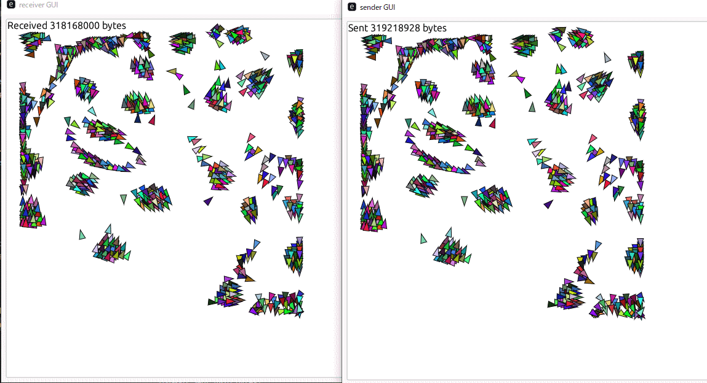

# Patchjuggler

An experimental pair of programs to exchange binary patches with UDP to update states among unreliable network.

## Data synchronization with UDP

UDP is untrustworthy, meaning a packet can be lost or duplicated.
This project is to demonstrate its effect in high load.
The project has 2 executables, both implemented as Rust binaries.

* Receiver
  ```
  cargo r --bin receiver
  ```

* Sender
  ```
  cargo r --bin sender
  ```

They should show very similar windows like below. They should be identical if they synchronize perfectly.
It is very likely that they are actually identical if you are running the programs in the same computer, because the packets are not actually sent over the network.

